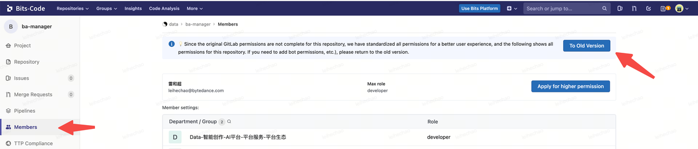
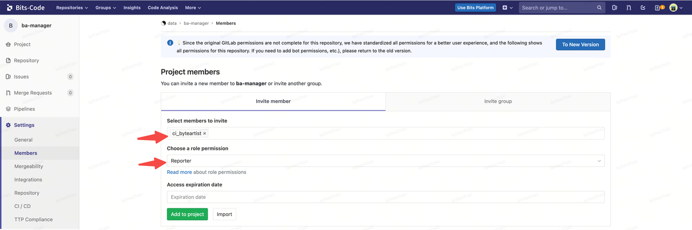
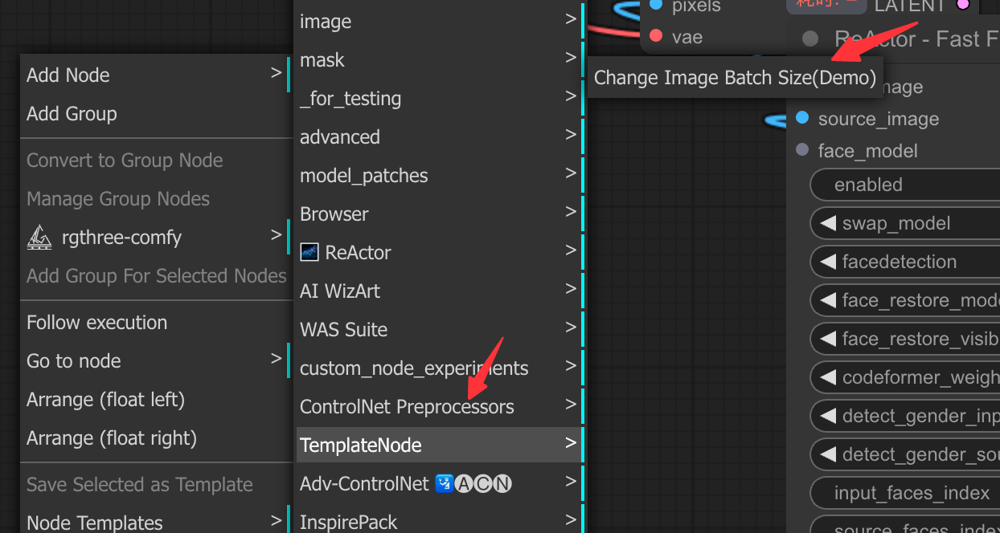

ComfyUI-Template-Node

## 强制规范

下述**代码权限**、**PIP依赖声明**、**模型安装或submodule初始化**章节，可以减少ComfyUI插件在BA房间内有关安装、启动、运行等方面的问题，建议阅读并结合自身开发插件改造

### 代码权限

**⚠️注意：自研插件代码仓库是公司内部的code平台，则需按照下面的步骤进行配置，否则无法通过BA 插件中心下载插件**

1. 打开插件对应的code地址，点击`Members`，再点击 `To Old Version`



2. 将`ci_byteartist`机器人添加到仓库成员列表中，赋予`Reporter`权限即可



### PIP依赖声明

#### 操作指南

**将插件所需的依赖声明在插件根目录下的requirements.txt文件中**

#### 错误示范

**在__init__.py中安装依赖**

##### 为什么不能在__init__.py中安装依赖？

- \_\_init\_\_.py是ComfyUI加载插件的入口

- 如果在其中执行依赖安装逻辑
  
  - 会增加插件的启动耗时，每次启动都会触发依赖安装逻辑
  
  - 增加心智负担，需要手动检测指定依赖是否安装
  
  - 如果依赖安装失败，会导致插件无法加载到ComfyUI

##### 为什么必须在requirements.txt中声明依赖?

- ba-manager会检测插件依赖是否成功安装，如果未安装或者上次启动安装失败，会安装插件对应的依赖
- 如果依赖安装报错，不会阻塞ComfyUI加载插件
- 降低心智负担，不需要实现依赖是否已安装的检测

### 模型安装或Git Submodule初始化

#### 操作指南

**在插件根目录下的install.py文件中，实现模型安装或者Submodule初始化相关的逻辑**

#### 模型目录管理

1. 建议将模型文件存放在 **ComfyUI/models/{subfolder}** 文件夹下
2. 如果ComfyUI/models 下的默认子目录，例如 checkpoints、controlnet不满足开发要求，建议在 models 文件夹下新建{subfolder}，并且**只存放 custom node 所需的模型文件**
3. **模型以外的依赖建议都放在插件自身目录下，例如Loki特效包**

#### 错误示范

**在__init__.py中下载模型文件**

##### 为什么不能在__init__.py中安装模型？

- \_\_init\_\_.py是ComfyUI加载插件的入口

- 如果在其中执行模型安装逻辑
  
  - 会增加插件的启动耗时，每次启动都会触发模型下载逻辑
  
  - 增加心智负担，需要手动检测模型文件是否下载
  
  - 如果模型下载失败，会导致插件无法加载到ComfyUI

##### 为什么必须在install.py中安装模型?

- ba-manager会检测插件是否成功执行install.py，如果未执行或者上一次启动执行报错，会重新执行该文件，触发模型安装逻辑
- 如果模型安装报错，不会阻塞ComfyUI加载插件
- 降低心智负担
  - 不需要实现模型是否已存在的检测
  - 不需要检测install.py是否成功执行

## 开发建议

下述内容仅作为开发参考，可以帮助初次接触ComfyUI插件开发的同学快速上手

### 插件基本结构

- \_\_init\_\_.py (必要): 注册节点时，通过该文件获取节点及其定义
- nodes/\_\_init\_\_.py (必要): 通过该文件统一导出nodes目录下实现的节点
- nodes/image_node.py (必要): 节点代码，可根据工程复杂程度，自行设计 nodes 下子模块目录结构
- readme.md (必要): 节点使用说明
- requirements.txt (可选): **pip 依赖列表**
  - **ByteArtist Manager 安装插件时**，**会从该文件安装依赖**
  - ComfyUI启动时，**ba-manager会检测插件依赖是否安装，如果未安装，会安装插件对应的依赖**
- helper/model_download.py: 下载模型的工具方法
- helper/path_manager.py: 统一的模型存放路径管理
- install.py(可选): **模型下载、初始化 git submodule 等可在此实现**
  - **ByteArtist Manager 安装插件时，会执行该文件**
  - ComfyUI启动时，**ba-manager会检测插件是否执行install.py，如果未执行，会执行该文件，触发模型安装逻辑**
- web (可选): custom node 节点的UI实现

### 模型安装

helper目录实现了下载模型的工具方法，可以直接使用，如下述代码所示

```python
from helper.model_download import download_model_hdfs, download_model_hdfs_batch, download_model_url,
    download_model_url_batch
from helper.path_manager import path_manager

# 根据单个hdfs链接下载模型到指定目录
download_model_hdfs(
    # hdfs链接地址
    hdfs_path="hdfs://haruna/...",
    # 模型文件存放目录，统一通过path_manager管理模型存放目录
    model_dir=path_manager.model_dict['clip'],
    # 当模型存放目录已经存在同名模型文件，是否覆盖，默认为False
    # is_overwrite=False,
)
# 根据多个hdfs链接下载模型到指定目录
download_model_hdfs_batch(
    # hdfs链接地址列表
    hdfs_paths=[
        "hdfs://xxx",
        "hdfs://xxx2",
    ],
    # 模型文件存放目录
    model_dir=path_manager.model_dict['facexlib'],
    # 当模型存放目录已经存在同名模型文件，是否覆盖，默认为False
    # is_overwrite=False,
)

# 根据http地址下载模型，参数说明和hdfs下载方法一致
download_model_url(
    model_url='https://xxx',
    model_dir='xxx'
)
# 根据http地址批量下载模型，参数说明和hdfs下载方法一致
download_model_url_batch(
    model_urls=[
        'https://xx',
        'https://xx2',
    ],
    model_dir='xxx'
)
```

### Python 依赖管理

#### 请使用 pip 私有源：

https://bytedance.larkoffice.com/wiki/wikcnApN5RWx8y5oyDl3vXVq6lb

#### 包内外依赖说明

##### 包外依赖

- 在custom node中，往往我们需要依赖一些Comfy UI内部的方法或者变量声明

- 例如我们想要扩展Comfy UI中aiohttp的接口，此时需要从Comfy UI中引入server.py文件

- 这类依赖不属于插件本身，我们称为包外依赖

##### 包内依赖

- 比如我们在custom node中，需要使用numpy进行数据处理，numpy是该插件内部需要的依赖，我们称为包内依赖

- 这类依赖需要声明在该插件根目录下的requirements.txt中

### 节点输入输出定义

参考nodes/image_node.py即可

```python
class ChangeImageSizeDemo:
   @classmethod
   def INPUT_TYPES(cls):
      return {
         "required": {
            "image": ("IMAGE",),
            "batch_size": ("INT", {"default": 1, "min": 1, "max": 200, "step": 1}),
            "mode": (["simple"],)
         }
      }

   CATEGORY = "TemplateNode"

   RETURN_TYPES = ("IMAGE",)
   FUNCTION = "load_image"

   def load_image(self):
      pass
```

- CATEGORY: 右键添加节点时，该节点所在的右键菜单目录
- FUNCTION: 执行该节点时，调用的函数名称，例如上述节点就会调用load_image函数
- RETURN_TYPES: 节点的输出类型定义
- INPUT_TYPES: 节点的输入类型定义
  - ComfyUI中的不同节点，只有相同类型的字段才可以进行数据交互
  - 比如节点A有一个输出字段类型为IMAGE，那么节点B需要有一个输入类型为IMAGE的字段，才可以与节点A进行数据通信

### 节点效果

在nodes/\_\_init\_\_.py进行节点注册

```python
from .image_node import ChangeImageSizeDemo

NODE_CLASS_MAPPINGS = {
   "ChangeImageSizeDemo": ChangeImageSizeDemo
}
NODE_DISPLAY_NAME_MAPPINGS = {
   "ChangeImageSizeDemo": "Change Image Batch Size(Demo)"
}
```

在ComfyUI中，右键菜单添加节点，我们可以看到


